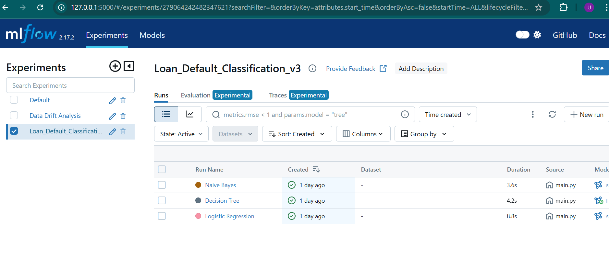

### MLflow Experiment and pushed the best model to model registry and then staged to production 

### Create a Experiment for Evidently AI for Data Drift Analysis  , 2 MLRuns one is historicaldata vs newdata and train vs test data.

